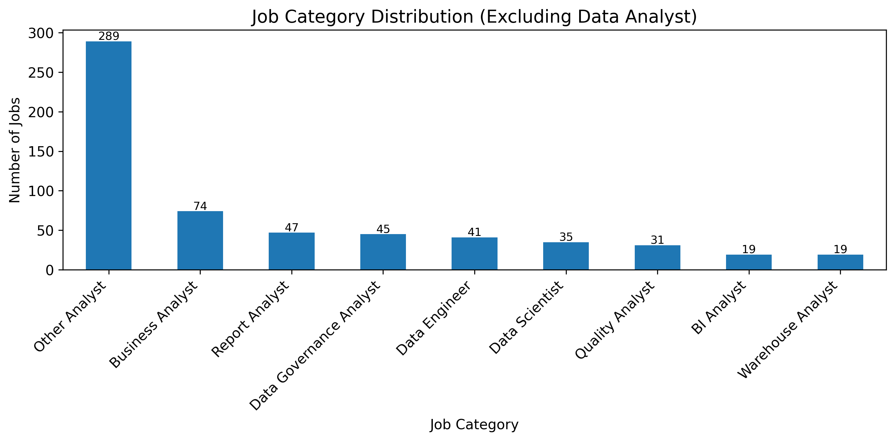
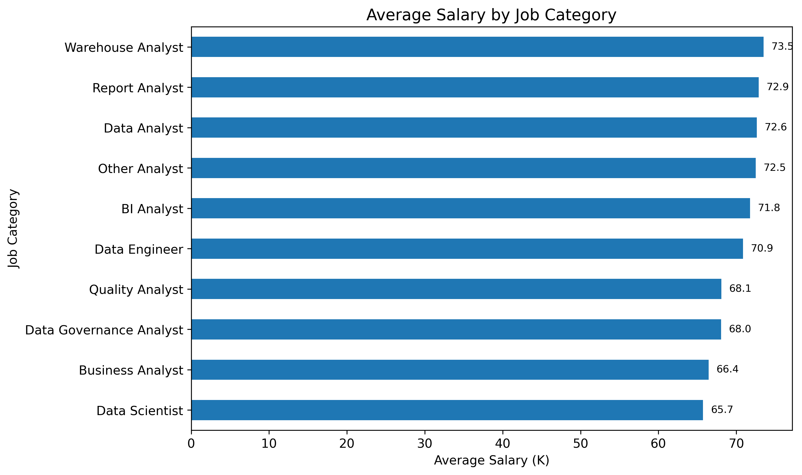
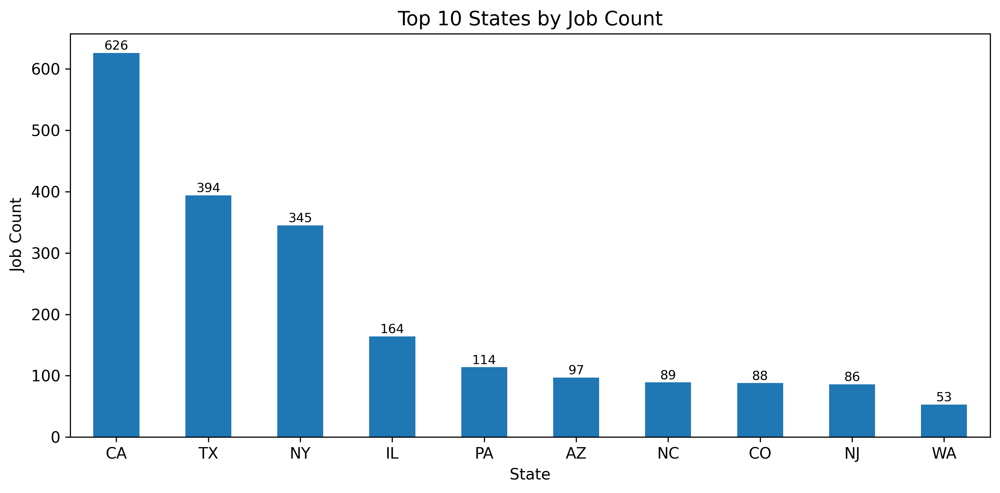
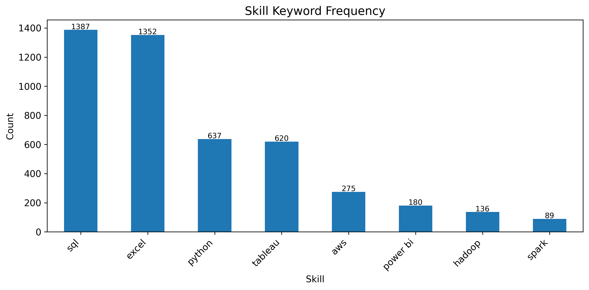
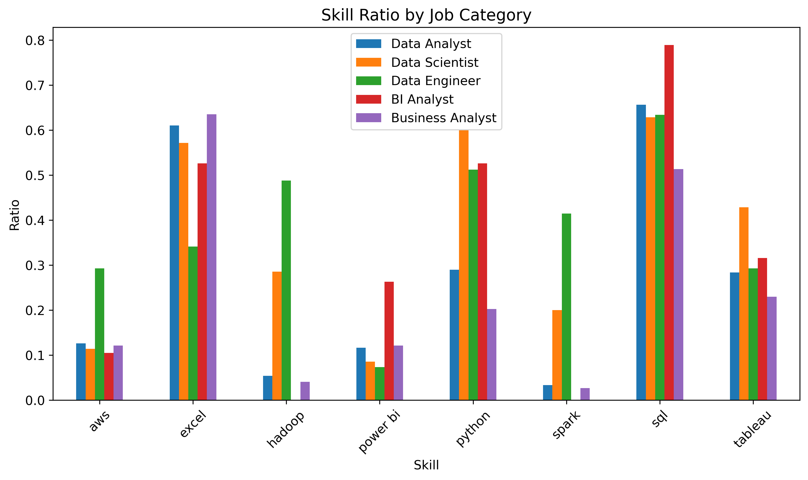
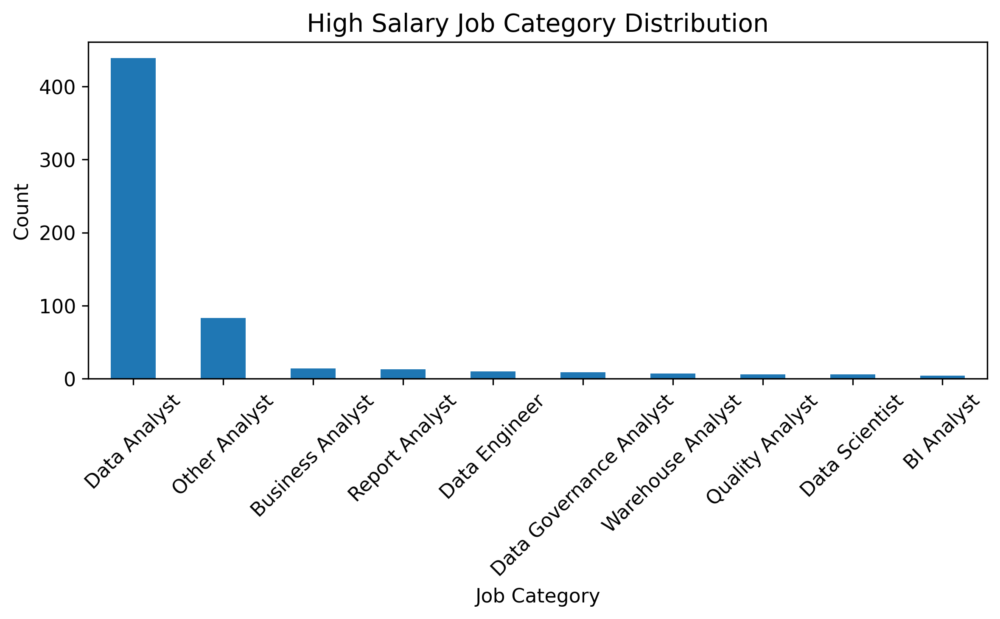
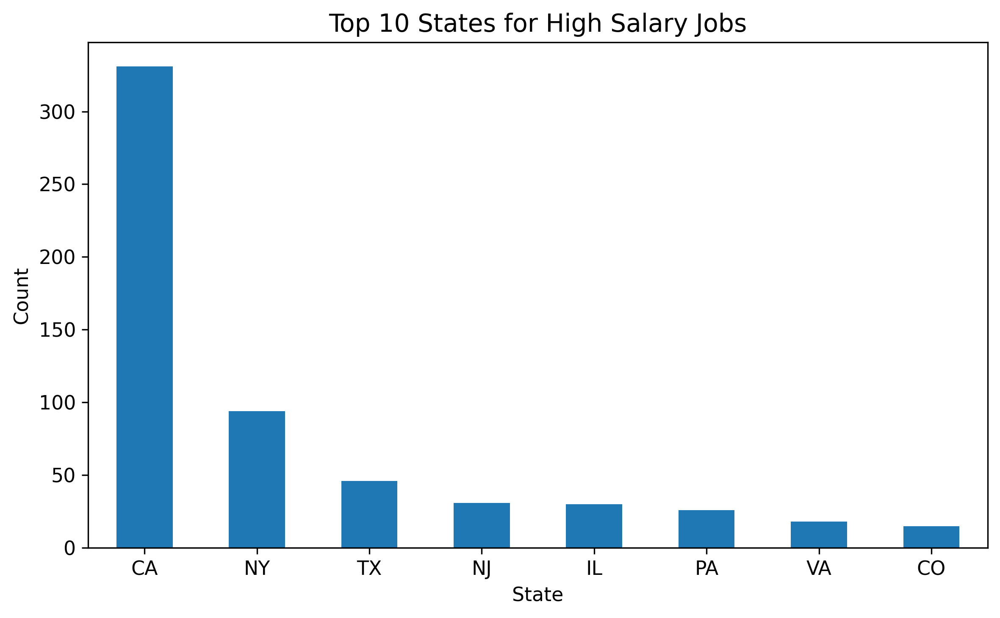
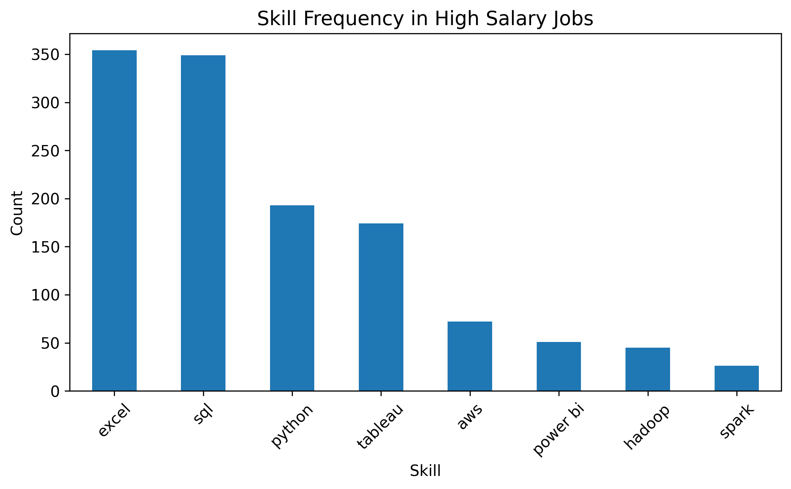
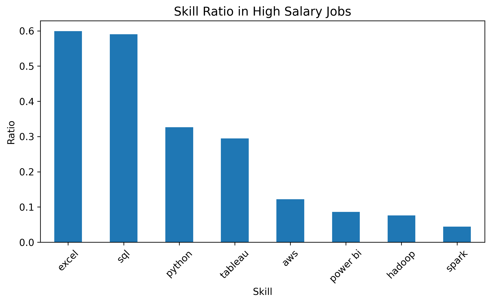

# 招聘岗位数据清洗与分析项目

## 项目简介
本项目基于 Kaggle 公开招聘岗位数据集，使用 Python 对原始招聘数据进行清洗、特征构造与可视化分析，围绕岗位需求分布、薪资差异、地区分布、技能要求以及高薪岗位特征展开研究，为理解数据岗位就业趋势提供参考。

---

## 数据来源
本项目使用的原始招聘岗位数据来自 **Kaggle 公开数据集**。  
数据集包含岗位名称、薪资区间、岗位描述、公司评分、公司名称、地点、行业等字段。

说明：
- 原始数据为公开数据集，仅用于个人学习与数据分析练习；
- 本项目在原始数据基础上进行了清洗、特征构造与可视化分析；
- 清洗后的结果文件保存为 `data/clean/jobs_clean.csv`。

---

## 项目亮点
- 对原始招聘数据进行了系统清洗，包括缺失值处理、字段重命名、薪资解析、地点拆分、公司名称清洗等；
- 基于岗位标题构建岗位分类字段，分析不同岗位类别的需求数量与平均薪资差异；
- 从岗位描述中提取 SQL、Excel、Python、Tableau 等技能关键词，识别招聘市场中的高频技能要求；
- 在整体技能词频统计基础上，进一步比较不同岗位类别的技能出现率，识别分析类岗位与技术类岗位在技能要求上的差异；
- 基于薪资分位数构建高薪岗位画像，从岗位类别、地区分布、技能要求和高薪占比等维度分析高薪岗位特征；
- 输出清洗后数据文件和多张可视化图表，形成完整的数据分析项目流程。

---

## 分析目标
本项目主要围绕以下问题展开：

- 哪类岗位招聘需求最多？
- 不同岗位类别的平均薪资有何差异？
- 招聘岗位主要集中在哪些州？
- 公司评分与薪资之间是否存在关系？
- 招聘岗位中最常出现的技能关键词有哪些？
- 不同岗位类别在技能要求上有何差异？
- 高薪岗位主要集中在哪些岗位类别、地区和技能要求上？

---

## 数据处理流程

### 1. 数据清洗
对原始数据进行了如下处理：

- 删除无关字段
- 重命名列名
- 处理缺失值
- 解析薪资区间字段，提取：
  - `salary_min`
  - `salary_max`
  - `salary_avg`
- 拆分地点字段，提取：
  - `city`
  - `state`
- 清洗公司名称
- 统一岗位标题并构建岗位分类字段

### 2. 特征构造
在清洗基础上进一步构造分析字段：

- 岗位类别字段 `job_category`
- 平均薪资字段 `salary_avg`
- 技能关键词统计结果
- 高薪岗位标签（基于 `salary_avg` 前 25% 分位数）

---

## 分析内容

### 1. 岗位类别分布
统计不同岗位类别的数量，观察招聘需求最集中的方向。

### 2. 不同岗位类别平均薪资分析
比较不同岗位类别之间的平均薪资差异，识别薪资水平较高的岗位类型。

### 3. 各州岗位数量分布
分析招聘需求在不同地区的分布情况，识别岗位更集中的州。

### 4. 公司评分与薪资关系
计算公司评分与平均薪资之间的相关性，观察两者是否存在显著线性关系。

### 5. 技能关键词分析
从岗位描述中提取常见技能关键词并统计其出现频率，包括：

- SQL
- Excel
- Python
- Tableau
- AWS
- Power BI
- Hadoop
- Spark

### 6. 不同岗位类别技能出现率分析
在整体技能词频统计基础上，进一步比较不同岗位类别中技能关键词的出现率，以消除样本量差异带来的影响，更公平地观察不同岗位类别的技能偏好。

### 7. 高薪岗位画像分析
以岗位平均薪资 `salary_avg` 的前 25% 作为高薪岗位标准，从岗位类别分布、地区分布、技能要求以及各岗位类别高薪占比等维度，对高薪岗位特征进行画像分析。

---

## 项目结论

1. **Data Analyst 是样本中数量最多的岗位类别**，说明数据分析类岗位在招聘市场中的需求最强。

2. **招聘岗位主要集中在 CA、TX、NY 等州**，其中加州在整体岗位数量和高薪岗位数量上都表现最突出，说明高薪数据岗位更集中于经济活跃、技术需求较强的地区。

3. **SQL、Excel、Python 是招聘市场中最常见的核心技能关键词**，表明数据查询、表格分析与基础编程能力是数据岗位的通用要求。

4. **不同岗位类别在技能要求上存在明显分工**：
   - Data Analyst 更偏 SQL、Excel、Python；
   - Data Engineer 更偏 Hadoop、Spark、AWS 等工程化与大数据技能；
   - BI Analyst 更强调 SQL、Power BI、Tableau 等数据展示与商业智能能力；
   - Business Analyst 更偏 SQL 与 Excel，工程化技能要求相对较低。

5. **公司评分与薪资之间线性相关性较弱**，说明公司评分并不是决定薪资水平的关键因素。

6. **高薪岗位数量最多的类别是 Data Analyst**，但从高薪占比看，不同岗位类别进入高薪区间的相对机会存在差异，说明“高薪岗位数量”和“高薪岗位占比”是两个不同维度。

7. **高薪岗位在技能要求上更集中于 SQL、Excel、Python、Tableau**，说明高薪岗位并不只强调工程类技术，也高度重视数据查询、分析处理和可视化表达等综合能力。

---

## 技术栈
- Python
- Pandas
- NumPy
- Matplotlib
- Jupyter Notebook

---

## 项目结构
```text
job-analysis-project/
├─ data/
│  ├─ raw/
│  │  └─ job_raw.csv
│  └─ clean/
│     └─ jobs_clean.csv
├─ figures/
│  ├─ job_category_distribution.png
│  ├─ job_category_average_salary.png
│  ├─ top10_states_job_count.png
│  ├─ skill_keyword_frequency.png
│  ├─ skill_ratio_by_job_category.png
│  ├─ high_salary_job_category_distribution.png
│  ├─ high_salary_top10_states.png
│  ├─ high_salary_skill_frequency.png
│  ├─ high_salary_skill_ratio.png
│  └─ high_salary_ratio_by_job_category.png
├─ notebook/
│  └─ job_analysis.ipynb
├─ README.md
├─ requirements.txt
└─ .gitignore
```


## 可视化展示

### 岗位类别分布图


### 岗位平均薪资图


### 各州岗位数量分布图


### 技能关键词频率图


### 不同岗位类别技能出现率图


### 高薪岗位类别分布图


### 高薪岗位州分布图


### 高薪岗位技能频率图


### 高薪岗位技能出现率图


## 项目输出

1. **清洗后的数据文件**：data/clean/jobs_clean.csv
2. **分析 Notebook**：notebook/job_analysis.ipynb

3. **可视化图表**：
   - 岗位类别分布图
   - 岗位平均薪资图
   - 各州岗位数量分布图
   - 技能关键词频率图
   - 不同岗位类别技能出现率图
   - 高薪岗位类别分布图
   - 高薪岗位州分布图
   - 高薪岗位技能频率图
   - 高薪岗位技能出现率图
   - 各岗位类别高薪占比图


## 项目不足
- 岗位分类主要基于关键词匹配，存在一定误差；
- 技能提取采用简单关键词统计，未使用更复杂的 NLP 方法；
- 薪资采用区间均值估算，不能完全代表真实收入水平；
- 数据来源有限，分析结果主要反映样本数据特征；
- 部分岗位类别样本量较小，高薪占比分析可能受到样本规模影响。

## 后续优化方向
- 优化岗位分类规则，提高分类准确性；
- 引入 NLP 方法进行技能提取与文本分析；
- 增加行业、公司规模、所有权等维度分析；
- 构建更细粒度的岗位层级分析，如 Junior / Senior / Lead；
- 使用 Tableau 或 Power BI 制作交互式可视化看板。
